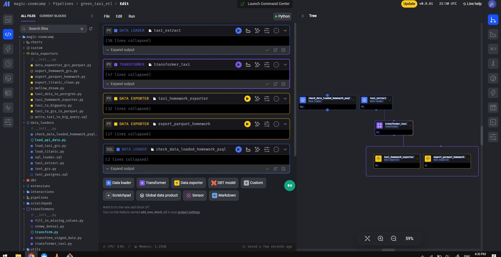
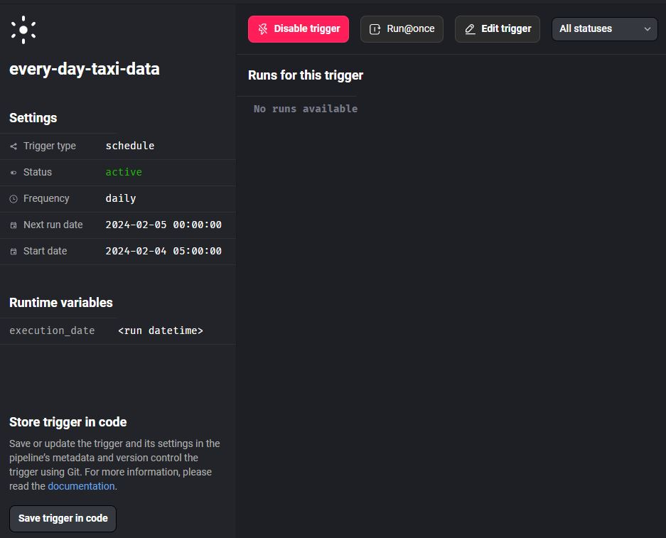

1. Extract data
```python
import io
import pandas as pd
import requests
if 'data_loader' not in globals():
    from mage_ai.data_preparation.decorators import data_loader
if 'test' not in globals():
    from mage_ai.data_preparation.decorators import test


@data_loader
def load_data_from_api(*args, **kwargs):
    """
    Template for loading data from API
    """
    url = 'https://github.com/DataTalksClub/nyc-tlc-data/releases/download/green/green_tripdata_2020-10.csv.gz'
    url2 = 'https://github.com/DataTalksClub/nyc-tlc-data/releases/download/green/green_tripdata_2020-11.csv.gz'
    url3 = 'https://github.com/DataTalksClub/nyc-tlc-data/releases/download/green/green_tripdata_2020-12.csv.gz'

    dfs = [] 

    taxi_data_types = {
        'VendorID': pd.Int64Dtype(),
        'passanger_count': pd.Int64Dtype(),
        'trip_distance': float,
        'RateCodeID': pd.Int64Dtype(),
        'store_and_fwd_flag': str,
        'PULocationID': pd.Int64Dtype(),
        'DOLocationID': pd.Int64Dtype(),
        'payment_type': pd.Int64Dtype(),
        'fare_amount': float,
        'extra': float,
        'mta_tax': float,
        'tip_amount': float,
        'tolls_amount': float,
        'improvement_surcharge': float,
        'total_amount': float,
        'congestion_surcharge': float
    }

    parse_dates = ['lpep_pickup_datetime', 'lpep_dropoff_datetime']
    month10 = pd.read_csv(url, sep=',', compression="gzip", dtype=taxi_data_types, parse_dates=parse_dates)
    month11 = pd.read_csv(url2, sep=',', compression="gzip", dtype=taxi_data_types, parse_dates=parse_dates)
    month12 = pd.read_csv(url3, sep=',', compression="gzip", dtype=taxi_data_types, parse_dates=parse_dates)
    dfs.append(month10)
    dfs.append(month11)
    dfs.append(month12)

    
    final_quarter_data = pd.concat(dfs, ignore_index=True)
    return final_quarter_data


```


2. transform data

```python
if 'transformer' not in globals():
    from mage_ai.data_preparation.decorators import transformer
if 'test' not in globals():
    from mage_ai.data_preparation.decorators import test


@transformer
def transform(data, *args, **kwargs):
    """
    Template code for a transformer block.

    Add more parameters to this function if this block has multiple parent blocks.
    There should be one parameter for each output variable from each parent block.

    Args:
        data: The output from the upstream parent block
        args: The output from any additional upstream blocks (if applicable)

    Returns:
        Anything (e.g. data frame, dictionary, array, int, str, etc.)
    """
    
    data = data[(data['passenger_count'] > 0) & (data['trip_distance'] > 0)]
    data['lpep_pickup_date'] = data['lpep_pickup_datetime'].dt.date

    # Rename columns in Camel Case to Snake Case
    data.columns = data.columns.str.lower().str.replace(' ', '_')
    data = data.rename(columns={'vendorid': 'vendor_id'})
    data = data.rename(columns={'ratecodeid': 'rate_code_id'})  
    data = data.rename(columns={'pulocationid': 'pu_location_id'}) 
    data = data.rename(columns={'dolocationid': 'do_location_id'})


    return data


@test
def test_output(output, *args) -> None:
    """
    Template code for testing the output of the block.
    """
    assert output is not None, 'The output is undefined'
    # Assertions
    assert output['vendor_id'].isin(output['vendor_id'].dropna()).all(), "Assertion Error: vendor_id is not one of the existing values in the column."
    assert (output['passenger_count'] > 0).all(), "Assertion Error: passenger_count is not greater than 0."
    assert (output['trip_distance'] > 0).all(), "Assertion Error: trip_distance is not greater than 0."

```

3. Load data: Postgresql, GCS

```python
from mage_ai.settings.repo import get_repo_path
from mage_ai.io.config import ConfigFileLoader
from mage_ai.io.postgres import Postgres
from pandas import DataFrame
from os import path

if 'data_exporter' not in globals():
    from mage_ai.data_preparation.decorators import data_exporter


@data_exporter
def export_data_to_postgres(df: DataFrame, **kwargs) -> None:
    """
    Template for exporting data to a PostgreSQL database.
    Specify your configuration settings in 'io_config.yaml'.

    Docs: https://docs.mage.ai/design/data-loading#postgresql
    """
    schema_name = 'ny_taxi'  # Specify the name of the schema to export data to
    table_name = 'green_taxi'  # Specify the name of the table to export data to
    config_path = path.join(get_repo_path(), 'io_config.yaml')
    config_profile = 'dev'

    with Postgres.with_config(ConfigFileLoader(config_path, config_profile)) as loader:
        loader.export(
            df,
            schema_name,
            table_name,
            index=False,  # Specifies whether to include index in exported table
            if_exists='replace',  # Specify resolution policy if table name already exists
        )

```

SQL checking data loaded in Postgres
```sql
SELECT * FROM ny_taxi.green_taxi LIMIT 10
```


upload to GCS partitioned by "lpep_pickup_date" and using pyarrow
```python
import pyarrow as pa
import pyarrow.parquet as pq
import os

if 'data_exporter' not in globals():
    from mage_ai.data_preparation.decorators import data_exporter

os.environ['GOOGLE_APPLICATION_CREDENTIALS']= "/home/src/magic-zoomcamp/copper-stacker-411515-d6430bdcd386.json"

bucket_name = 'taxi_demo_zhou'
project_id = 'copper-stacker-411515'
table_name = 'nyc_taxi_green_data'
root_path = f'{bucket_name}/{table_name}'

@data_exporter
def export_data(data, *args, **kwargs):
    data['lpep_pickup_date'] = data['lpep_pickup_datetime'].dt.date
    table = pa.Table.from_pandas(data)

    gcs = pa.fs.GcsFileSystem()

    pq.write_to_dataset(
        table,
        root_path=root_path,
        partition_cols=['lpep_pickup_date'],
        filesystem=gcs
    )
```

# images and my trigger


